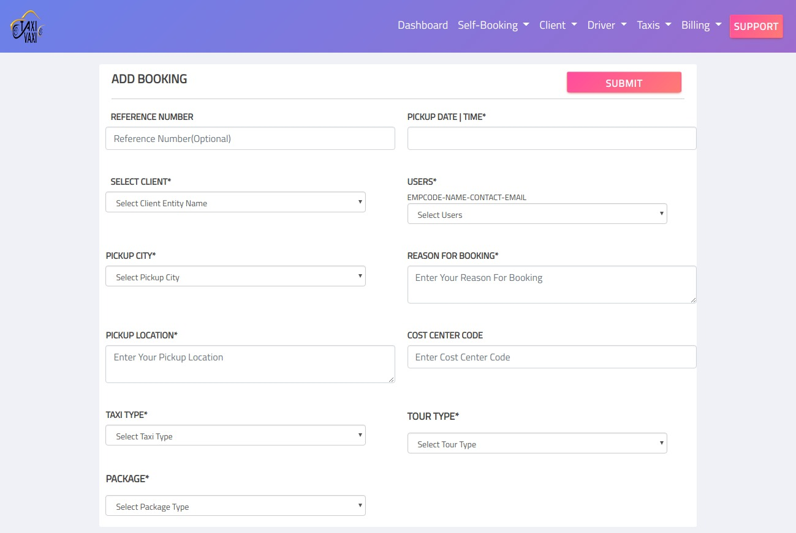
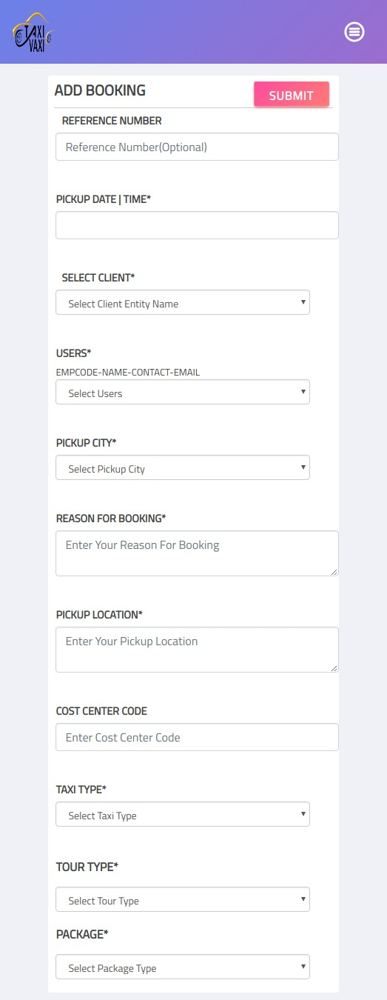

# Add-Form-Page
[Demo of add form  web page](https://designer199.github.io/Add-Form-Page/)

## Dated : 3rd Nov 2018
Incorporated following changes in add form page

- [x] Input boxes are not aligned properly.
- [x] Submit button should be at the bottom.
- [x] Integrated calendar for Pickup time. 
  ### Note :calender is integrated using jquery .I tried to find a date time picker for  bootstrap4 but its only avaliable in bootstrap 3.
  
 

## Dated : 3rd Nov 2018
Incorporated following changes in add form page

- [x] Input boxes are not aligned properly.
- [x] Submit button should be at the bottom.
- [x] Integrated calendar for Pickup time. 
  ### Note :calender is integrated using jquery .I tried to find a date time picker for  bootstrap4 but its only avaliable in bootstrap 3.
  
 

## Dated : 2st Nov 2018

- [x] Add form page is completed and responsive for mobile ,tablet and desktop.

## Things that I noticed

 - [ ] The original sass code threw a lot of errors when compiled into css and the page was not responsive. So I had to  write    new code in bootstrap 4 to make the form mobile-first/responsive.
 
 ### Desktop View     
   
  
 ### Mobile View

 

